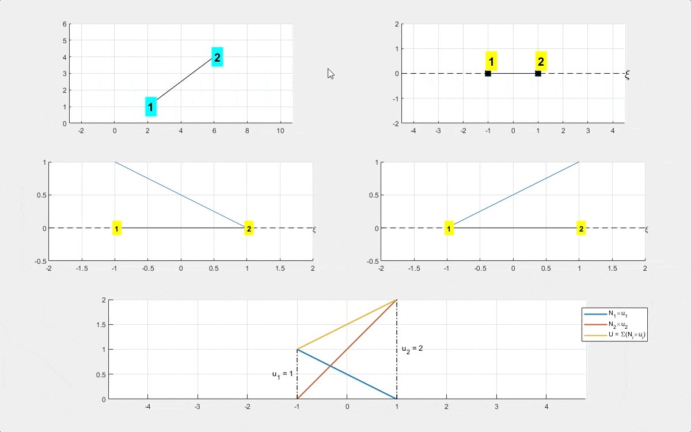

# FEM_Educational_Demos
A set of educational and visualization scripts to help engineering students learn and internalize FEM concepts.

| 
Developed by Shahrokh Shahi
|
|:----------|
| 
Georgia Institute of Technology   College of Computing and College of Engineering   2018-2020
|
| 
<a  href="www.sshahi.com" target="_blank">www.sshahi.com
|

#### Details:
This repository is part of a set of FEM-related codes, where you can find more details in <a href="https://www.sshahi.com/projects/cse-fem-demo/" target="_blank">this blog post</a>. 

>    In general, <a  href="https://en.wikipedia.org/wiki/Finite_element_method" target="_blank">finite element method (FEM)</a> is used as an effective numerical method to solve differential equations and widely employed in engineering and mathematical modeling, where a mechanical system is divided into discrete subdomains known as finite elements. The technical process of creating finite element meshes and using Gaussian numerical integration to calculate the stiffness of each element, assembly process, and solving the obtained system of equations have always been challenging to implement and understand by both undergrad and graduate students in engineering fields such as Civil Engineering, Mechanical Engineering, Aerospace Engineering, etc. Therefore, as a TA in FEM and advanced FEM course, who also held several sessions and workshops for MATLAB programming and developing FEM codes, I started to develop many demonstrations and educational toolboxes to help students internalize these technical steps. The following is the datails regarding these packages and codes predented in the three sub-sections.

> The first set includes interactive demonstrations that I created to teach the concepts of <a  href="https://www.sciencedirect.com/topics/engineering/shape-function" target="_blank">shape functions</a>, and the transformation between natural and global coordinates, which is important for numerical integrations and obtaining the element stiffness matrices and equivalent nodal forces. I found these visualizations very helpful and effective in classrooms; therefore, decided to share and make them available for other students and instructors. 

---

#### Sample runs:

 

 

---